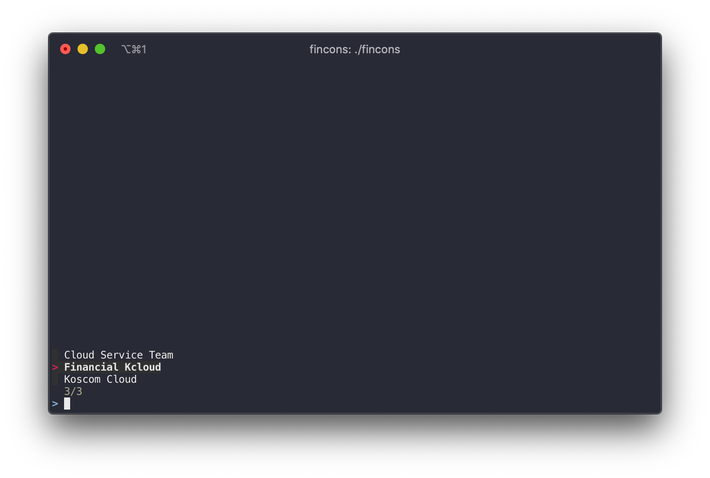

# VPN Connection tools for Financial Cloud

**`fincons`** helps switch between sslvpn connections:


fincons is a shell script to manage and switch between vpn connections.

```
USAGE:
  fincons                : list the fincloud console sslvpn
  fincons -c,--current   : show the current connected sslvpn
  fincons -h,--help      : show this message
```

### Usage

```
$ fincons
Preview sslvpn connection information.
```

---

## Installation

There are a installation options:

- MacOS
  - Homebrew (only one)

### MacOS

#### Homebrew

If you use [Homebrew](https://brew.sh/) you can install like this:

```
brew tap samjegal/fincloud
brew install fincons
```

This command will install and manage script automatically.

---

Disclaimer: This is not an official [NBP Financial Cloud](https://www.fin-ncloud.com) product.
